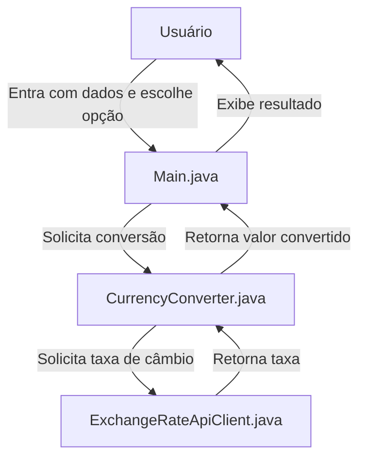

# Conversor de Moedas

## Descrição

Este projeto é um conversor de moeda desenvolvido como parte do Desafio Oracle ONE (Oracle Next Education). Ele permite que os usuários realizem conversões de moeda entre diferentes moedas utilizando taxas de câmbio em tempo real.

## Funcionalidades

- Conversão de Moeda:
  - Conversão entre várias moedas (BRL, USD, EUR, GBP, ARS, CLP)
  - Taxas de câmbio em tempo real
  - Interface amigável

## Tecnologias Utilizadas

- Java
- Programação Orientada a Objetos
- Api Externa (ExchangeRate-Api)

## Pré-requisitos

- Java Development Kit (JDK) 17 ou superior

## Instalação

1. Clone este repositório:

```bash
git clone [repository-url]
```

2. Abra o projeto em sua IDE preferida
3. Compile o projeto usando Maven:

```bash
mvn clean install
```

4. Execute a aplicação

## Como Usar

1. Execute o arquivo JAR gerado:

```bash
java -jar target/currency-converter-1.0-SNAPSHOT.jar
```

2. No menu interativo:
   - Escolha uma das opções de conversão (1-6)
   - Digite o valor a ser convertido quando solicitado
   - Veja o resultado da conversão
   - Digite 's' para continuar convertendo ou 'n' para sair
   - Escolha a opção 7 para sair do programa

### Diagrama de Fluxo do Sistema



## Contribuindo

Este projeto é parte de um desafio de aprendizado. Embora não esteja aberto para contribuições diretas, sinta-se à vontade para fazer um fork e adaptá-lo para seus próprios propósitos de aprendizado.

## Licença

Este projeto está licenciado sob a Licença MIT - consulte o arquivo LICENSE para obter detalhes.

## Agradecimentos

- Oracle Next Education
- Alura
